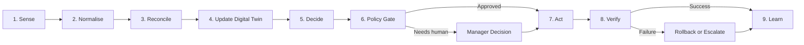
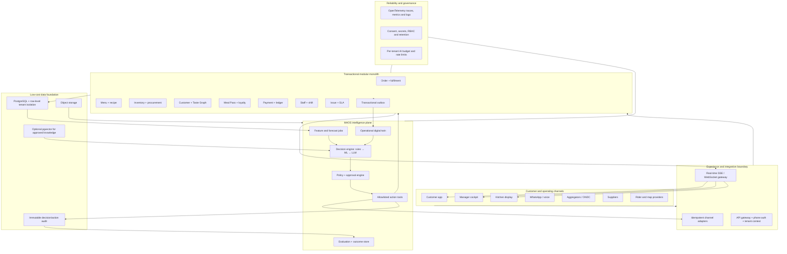

# AI-Native Cloud Kitchen Operating System

## International innovation benchmark, automation blueprint and MAOS protocol

**Product scope:** customer application, kitchen operations and manager control system

**Primary market:** multi-brand cloud kitchens in India

**Document status:** product and engineering standard

**Date:** 29 July 2026

---

## Implementation progress

This document is the implementation source of truth and will be updated after
each completed step.

- [x] **Step 1 — Canonical MAOS contracts:** tenant, outlet, customer, consent,
  order lifecycle, event envelope, decision proposal, approval controls and
  action receipt are implemented as tested TypeScript contracts.
- [x] **Step 2 — PostgreSQL foundation:** migrations, tenant isolation,
  transaction boundaries and event outbox.
- [ ] **Step 3 — Phone authentication API:** OTP provider boundary, secure
  sessions and customer migration from browser-only storage.
- [ ] **Step 4 — Order vertical slice:** persisted checkout, kitchen tasks,
  order-risk projection and live tracking.
- [ ] **Step 5 — Manager exception workflow:** evidence, approval, action,
  verification and rollback.

Implementation files for Step 1 are documented in
[`backend/README.md`](../backend/README.md).

---

## 1. Executive decision

The product should not become another manual restaurant-management suite with an AI chatbot added on top. It should become an **AI-native operating system for cloud kitchens**.

The key product promise is:

> The system continuously understands demand, orders, kitchen capacity, stock, delivery risk, customer preferences and cash movement; it completes safe routine work automatically and asks the manager only for decisions that need human judgment.

The defensible advantage will come from four connected assets:

1. A first-party customer and Taste Graph that improves after every interaction.
2. A real-time operational digital twin of every kitchen.
3. A controlled automation protocol that turns recommendations into verified actions.
4. An outcome history that teaches the system what works for each outlet, menu and customer segment.

This is different from conventional restaurant software. Conventional systems record what staff enter. This system should **sense, decide, act, verify and learn**, while preserving clear human control.

The recommended standard is named **MAOS — Mangamma Autonomous Operations Standard**. “Autonomous” does not mean unsupervised. Every action is constrained by permissions, monetary limits, confidence thresholds, consent, audit records and rollback rules.

---

## 2. What international products are doing well

The following patterns are already being used by leading restaurant technology companies outside India. They should be adapted to Indian cloud-kitchen economics rather than copied feature-for-feature.

| International pattern | Current example | What is valuable | How this product should improve it |
|---|---|---|---|
| Unified guest profiles and personalised ordering | [Olo Serve](https://www.olo.com/serve) and [Olo Guest Data Platform](https://www.olo.com/gdp) unify ordering, payment, loyalty and guest signals. Olo also uses order history, location, daypart and cart context for [AI smart cross-sells](https://investors.olo.com/news/news-details/2024/Olo-Introduces-Smart-Cross-Sells-to-Increase-Guest-Engagement-and-Drive-Sales/default.aspx). | First-party data makes the experience improve over time and reduces dependence on aggregators. | Build a phone-number Taste Graph, explain recommendations, include Indian dietary schedules, family recipients, budget and spice preferences, and connect it to Meal Pass planning. |
| AI-readable customer relationship management | [SevenRooms CRM](https://sevenrooms.com/platform/crm/) unifies guest data and uses AI to normalise staff notes into usable profiles. | Important customer knowledge no longer stays in the memory of one employee. | Convert calls, feedback and issue resolutions into consented, structured preferences; never let free-text AI notes become facts without provenance. |
| Central order and menu orchestration | [Deliverect](https://www.deliverect.com/en/deliverect-restaurants) centralises orders, menus, stores and stock across ordering channels. | Eliminates repeated order entry and inconsistent availability. | Create one internal order state machine and idempotent adapters for the customer app, POS, ONDC/aggregators, WhatsApp and catering. |
| AI embedded inside staff workflows | [ToastIQ](https://pos.toasttab.com/news/toast-launches-toastiq-superpower-future-of-restaurants) includes marketing help, menu upsells, shift summaries and digital kitchen workflows. | AI appears at the moment of work instead of in a separate analytics product. | Put recommendations and actions in the live order queue, inventory exception, customer issue and closing flows—not in an isolated “AI” page. |
| Financial and operational anomaly detection | [Restaurant365 AI](https://www.restaurant365.com/ai/) applies AI to P&L review, forecasting, purchase orders, prep, recipe cost, timecards and scheduling. | Managers can focus on unusual movements instead of reviewing every row. | Start with an explainable daily margin bridge and reconciliation agent: “food cost rose because paneer price and portion variance increased.” Require approval for financial postings. |
| Weather-, event- and manager-aware forecasting | [Tenzo forecasting](https://support.gotenzo.com/docs/forecasting-overview-what-it-is-and-how-it-works/) combines sales history, seasonality, weekday, events and weather, while recording manager adjustments. | A forecast becomes an operational input for labour and prep rather than a static chart. | Forecast at 15-minute, station, SKU and meal-plan level; compare machine forecast with manager override and learn which adjustment was more accurate. |
| AI intake of unstructured supplier orders | [Choco OrderAgent](https://choco.com/us/stories/suppliers/from-restaurant-app-to-ai-partner-for-distributors-the-evolution-of-choco) extracts orders from email, voicemail, PDF and text before passing them to an ERP. | Removes manual re-keying from informal business communication. | In India, ingest supplier WhatsApp messages, invoice photos, calls and PDFs; validate SKU, unit, GST, price variance and duplicate invoices before creating a purchase-order draft. |
| Voice ordering and employee assistance | [SoundHound restaurant voice AI](https://www.soundhound.com/voice-ai-solutions/restaurants/) supports phone ordering and hands-free employee answers from operational material. | Voice serves customers and staff when screens are inconvenient. | Add multilingual Hindi/English/regional-language ordering only after the structured order engine is reliable. Use retrieval from approved recipe and allergen records, not model memory. |
| Computer-vision food-waste measurement | [Winnow](https://www.winnowsolutions.com/product/food-waste-management-software) combines a camera and scale to identify discarded food. | Waste becomes measurable by item, reason and service period. | Begin with low-cost staff photo/weight capture and prep variance; offer dedicated camera-scale hardware only to kitchens with enough waste to justify it. |
| Guest intelligence that suggests the next action | [Olo Guest Intelligence](https://www.olo.com/product-release) is moving from reporting what happened toward explaining why and proposing actions. | A manager receives decisions, not another dashboard. | Every insight should include evidence, expected impact, confidence, expiry, risk class, approval requirement and a way to undo the action. |

The international lesson is not “add more modules.” It is that the best systems are converging on:

- one connected guest identity;
- real-time cross-channel operations;
- forecasts that feed actual work;
- AI assistance inside the workflow;
- automatic capture of unstructured inputs;
- exception management rather than constant dashboard monitoring.

Vendor performance numbers should be treated as directional because they are vendor-reported. The product should establish its own baselines and controlled pilot results before making commercial claims.

---

## 3. Product experience to inculcate

### 3.1 Customer-side innovations

The customer application should become an adaptive food companion, not a static menu.

#### A. “For You, Right Now”

Rank dishes using:

- taste and dietary match;
- time of day and day of week;
- current kitchen load and honest ETA;
- delivery distance;
- budget and portion needs;
- reorder rhythm;
- Meal Pass balance;
- stock freshness and availability;
- exploration versus familiarity.

Each recommendation needs a short reason such as “your usual mild Tuesday dinner” or “high-protein and deliverable in 24 minutes.” Recommendations must never expose sensitive inferred attributes.

#### B. Adaptive Meal Pass

Allow customers to choose meals, delivery windows, diet, spice and weekly budget, then let the plan adapt:

- propose next week from previous ratings and skips;
- avoid repeating disliked combinations;
- allow skip, swap, pause, reschedule and cancel without support;
- show per-meal and total savings;
- predict a missed delivery window before the customer has to complain;
- allow transparent recurring UPI mandates.

[NPCI UPI AutoPay](https://www.npci.org.in/product/autopay) supports recurring mandates that customers can pause, modify or revoke, making it appropriate when cancellation and mandate controls remain visible.

#### C. Contextual cart intelligence

The system should optimise customer value and kitchen feasibility together:

- useful complements, not the highest-priced item;
- “complete the meal” bundles;
- shared-cart suggestions based on participant diets;
- packaging and quantity warnings;
- substitute suggestions when an item risks delay;
- post-purchase add-ons only while preparation has not crossed the locking point.

#### D. Reliability as a visible product

Show the customer:

- order accepted;
- kitchen queue position;
- preparation milestones;
- quality/packaging check;
- rider assignment and route progress;
- reason for any ETA change;
- guarantee status and automatic credit eligibility.

The map is only one part of tracking. The more defensible feature is a trustworthy **kitchen-to-door event timeline**.

#### E. Family and group intelligence

Build:

- multiple recipients under one phone profile;
- saved taste and allergy profiles per family member;
- elder-friendly repeat order;
- office and group cart;
- split payment or one sponsor;
- meal gifting;
- shared Meal Pass allowance;
- consented reminder when a regular recipient may need a meal.

#### F. Ethical engagement loop

Use:

- useful mealtime reminders based on a customer-selected schedule;
- loyalty progress;
- cuisine exploration;
- genuine limited menu drops;
- weekly plan progress;
- referral qualification status;
- easy notification controls.

Do not use fake scarcity, misleading timers, dark-pattern cancellation, spam or chance-based rewards. Retention should come from relevance, reliability and accumulated preferences.

### 3.2 Manager-side innovation

The manager should open a **Today Cockpit**, not ten reports.

The first screen answers:

1. What needs my decision now?
2. What is likely to go wrong next?
3. What has the system already handled?
4. What changed profit, service or waste today?

The interface should contain:

- an exception inbox ordered by expected impact and urgency;
- three to seven recommended decisions, not hundreds of metrics;
- a live kitchen digital twin;
- a morning plan;
- a shift timeline;
- a closing and reconciliation summary;
- an “ask the kitchen” command bar;
- clear evidence, confidence, approval and undo controls.

Example:

> **Action requested:** Pause Paneer Tikka on two delivery channels for 38 minutes.
>
> **Evidence:** 6 portions in stock, 9 already committed, supplier arrival at 19:10, station load 92%.
>
> **Expected result:** prevent 5 likely cancellations and 47 minutes of cumulative delay.
>
> **Confidence:** 91%.
>
> **Approval:** one tap; automatically restore when verified stock is available.

---

## 4. The AI management system

### 4.1 Automation portfolio

| Priority | Agent | What it observes | What it produces or does | Manager time saved | Control level |
|---|---|---|---|---|---|
| P0 | Morning Briefing Agent | reservations, subscriptions, forecast, staffing, stock, open issues, supplier ETA | shift plan, prep exceptions and the top decisions for the day | Replaces report gathering and morning spreadsheet review | Draft automatically; manager approves plan |
| P0 | Order Promise Agent | queue, station capacity, item prep time, rider supply, route and weather | honest promise time, capacity slot and risk score before checkout | Reduces manual ETA intervention and complaints | Auto within tested bounds |
| P0 | Kitchen Flow Agent | accepted orders, recipes, dependencies, stations and elapsed time | sequenced production tasks, batching and late-order recovery | Reduces expediting and verbal coordination | Auto sequencing; manager can override |
| P0 | Availability Guardian | on-hand stock, committed quantity, recipe requirements and delivery receipts | low-stock warning, channel pause, substitute or limited-quantity proposal | Prevents repeated stock checks and unavailable-item cancellations | Auto low-risk warnings; approval to pause channels initially |
| P0 | Issue Resolution Copilot | order events, photos, chat/call transcript, policy and customer history | classifies issue, finds probable cause, drafts resolution and credit | Shortens investigation and support handling | Auto draft; threshold-based approval for money |
| P0 | Closing and Reconciliation Agent | orders, payments, refunds, channel settlements, cash, credits and wastage | mismatch list, closing journal draft and daily margin bridge | Replaces manual cross-checking | Never post irreversible entries without approval |
| P1 | Demand and Prep Forecast Agent | sales, weather, event, holiday, campaigns, subscriptions and local patterns | outlet/SKU/station forecast, prep sheet and uncertainty range | Replaces manual forecast calculation | Manager adjusts/approves; accuracy compared |
| P1 | Procurement Agent | forecast, stock, yield, lead time, supplier price and reliability | purchase-order draft, supplier choice and delivery schedule | Removes repetitive ordering and price comparison | Approval required until supplier/amount policies mature |
| P1 | Labour Planner | demand by interval, skill matrix, attendance, law/policy and historical throughput | shift and break proposal; understaffing risk | Reduces roster preparation | Human approval required |
| P1 | Taste and Retention Agent | consented customer events, tastes, plan behaviour and service history | ranking, next-best action, churn prevention and personalised message | Reduces manual campaign segmentation | Auto in-app ranking; consent and frequency gate for outreach |
| P1 | Review and CRM Agent | ratings, reviews, feedback, issues and resolutions | theme summary, response draft and recovery list | Reduces daily review triage | Approval for public response initially |
| P2 | Voice and Message Intake Agent | phone, WhatsApp, email, supplier PDFs and invoice photos | structured order or invoice proposal with confidence and validation | Removes re-keying | Explicit confirmation for customer orders; approval for supplier records |
| P2 | Waste Intelligence Agent | prep records, sales, discard weight/photo and reason | item-level waste, root cause and next-day prep correction | Removes waste tallying and investigation | Recommendation only until measured accuracy is high |
| P2 | Owner Strategy Copilot | unit economics, cohorts, menu contribution, capacity and service | weekly business narrative and controlled experiment proposals | Compresses multi-outlet review | Advice only |

### 4.2 The correct role for different kinds of AI

Use the cheapest reliable method for each decision:

| Need | Correct technology | Do not use |
|---|---|---|
| Permission, refund limit, allergen block, operating hours | deterministic rules | an LLM |
| Demand, ETA, churn, item ranking, anomaly score | statistical/ML model with measured error | free-form text generation |
| Extract invoice, summarise reviews, interpret a manager request | language/vision model with a strict schema | direct database write |
| Answer an SOP or recipe question | retrieval from approved documents with citations | model memory |
| Trigger a business action | allowlisted tool behind policy and approval service | autonomous arbitrary code |
| Calculate totals, taxes, ledger and stock | transactional code | generated arithmetic |

This separation is the largest cost and safety advantage. Most events can be handled with SQL, rules and small models. A language model should be called only when the input or output is genuinely unstructured.

---

## 5. MAOS: the standard operating protocol

Every automated workflow must follow the same nine-stage lifecycle.



1. **Sense:** receive a customer, order, kitchen, stock, payment, rider or supplier event.
2. **Normalise:** convert external data to one versioned internal contract.
3. **Reconcile:** remove duplicates, reject invalid transitions and resolve conflicting sources.
4. **Contextualise:** update the operational digital twin and relevant derived features.
5. **Decide:** apply rules first, then predictive models, then language models where required.
6. **Policy gate:** check tenant, role, consent, risk, confidence, money, rate, expiry and approval.
7. **Act:** invoke one allowlisted tool using an idempotency key.
8. **Verify:** confirm the desired state from the system of record, not from the model response.
9. **Learn:** record outcome, override, error and business impact for evaluation.

### 5.1 Standard event envelope

Use the [CloudEvents specification](https://github.com/cloudevents/spec) as the base event format so that internal and partner events share a common shape.

```json
{
  "specversion": "1.0",
  "type": "order.promise_at_risk",
  "source": "rms/order-core",
  "id": "evt_01J...",
  "time": "2026-07-29T13:12:08Z",
  "subject": "tenant/t_18/outlet/o_04/order/ord_922",
  "datacontenttype": "application/json",
  "tenant_id": "t_18",
  "outlet_id": "o_04",
  "correlation_id": "cor_68...",
  "causation_id": "evt_01H...",
  "idempotency_key": "order:ord_922:risk:v3",
  "schema_version": "1.0",
  "data_class": "operational",
  "consent_ref": null,
  "data": {
    "promised_at": "2026-07-29T13:35:00Z",
    "predicted_ready_at": "2026-07-29T13:43:00Z",
    "risk_probability": 0.87,
    "primary_constraint": "grill_station"
  }
}
```

Required rules:

- Event IDs and idempotency keys must prevent duplicate actions.
- `tenant_id` and `outlet_id` must be enforced at the database and service boundary.
- Personally identifiable information must not be copied into general event payloads.
- Schemas must be versioned and backward compatible.
- Sensitive data classes must define retention and access policy.
- External events must retain source and raw-reference provenance.

### 5.2 Standard decision proposal

AI never returns only a sentence. It returns a typed proposal:

```json
{
  "proposal_id": "prp_01J...",
  "objective": "protect_delivery_promise",
  "trigger_event_ids": ["evt_01J..."],
  "recommended_action": {
    "tool": "menu.pause_item",
    "arguments": {
      "outlet_id": "o_04",
      "item_id": "item_27",
      "channels": ["customer_app", "partner_a"],
      "duration_minutes": 38
    }
  },
  "evidence": [
    {"metric": "available_portions", "value": 6, "source": "inventory"},
    {"metric": "committed_portions", "value": 9, "source": "orders"}
  ],
  "confidence": 0.91,
  "expected_impact": {
    "avoided_cancellations": 5,
    "avoided_delay_minutes": 47
  },
  "risk_class": "A2",
  "approval": "outlet_manager",
  "expires_at": "2026-07-29T13:18:00Z",
  "rollback_plan": "restore_when_stock_receipt_verified",
  "policy_version": "availability-2.1",
  "model_id": "availability-risk-7",
  "prompt_version": null
}
```

### 5.3 Standard action receipt

Every attempted action, including failure, produces an immutable receipt:

```json
{
  "action_id": "act_01J...",
  "proposal_id": "prp_01J...",
  "actor": {"type": "manager", "id": "usr_14"},
  "tool": "menu.pause_item",
  "before_state_hash": "sha256:...",
  "external_reference": "partner-job-819",
  "status": "verified",
  "verification": {
    "checked_at": "2026-07-29T13:13:02Z",
    "channels_updated": 2,
    "channels_failed": 0
  },
  "after_state_hash": "sha256:...",
  "rollback_until": "2026-07-29T13:51:00Z",
  "duration_ms": 842,
  "estimated_ai_cost_inr": 0.00
}
```

### 5.4 Action risk classes

| Class | Meaning | Examples | Default control |
|---|---|---|---|
| A0 | Observe or draft | summary, anomaly, response draft | Automatic |
| A1 | Low-risk and reversible | reorder tasks, prep checklist, in-app recommendation, internal reminder | Automatic within policy and monitored |
| A2 | Operational impact | item pause, prep quantity, shift draft, supplier-order draft | Manager approval during initial rollout; later limited automation |
| A3 | Financial or customer commitment | refund, credit, price, campaign send, purchase order | Explicit approval plus amount/frequency limits |
| A4 | Critical or legally sensitive | bank detail change, tax filing, allergen override, food-safety certification, termination decision | Two-person control or prohibited from AI execution |

No model may write directly to production tables. It can only propose an allowlisted tool call. The policy service, not the model, decides whether it can execute.

---

## 6. Target architecture

### 6.1 Logical architecture



### 6.2 Why a modular monolith should come first

The first production version should be a well-separated modular monolith, not a fleet of microservices.

Use:

- one TypeScript backend deployment;
- one managed PostgreSQL database;
- versioned modules and internal interfaces;
- a transactional outbox for reliable events;
- background workers from the same codebase;
- object storage for invoices, issue photos and exports;
- server-sent events for most real-time UI updates;
- a small Python forecasting service/job only where the ML ecosystem materially helps.

This keeps infrastructure, deployment and debugging costs low while preserving boundaries that can later be separated. Kafka, Kubernetes, a dedicated vector database, a feature-store platform and multiple streaming systems are unnecessary at pilot scale.

### 6.3 Core bounded modules

| Module | Owns |
|---|---|
| Identity and Tenant | phone OTP, sessions, staff roles, outlet access, consent references |
| Customer and Taste | profiles, recipients, preferences, allergies, behavioural signals and recommendation feedback |
| Catalog and Recipe | brands, menus, availability, recipes, yields, allergens, modifiers and cost versions |
| Order | cart, quote, order state machine, channel source and idempotency |
| Kitchen Orchestration | station tasks, dependencies, batching, actual preparation time and quality checks |
| Fulfilment | address, geocoding, rider, route, milestone tracking, ETA and proof |
| Meal Pass and Loyalty | plan, entitlement, schedule, skip/swap, credits, tiers and referral |
| Inventory and Procurement | lots, stock movements, committed stock, waste, suppliers, POs and receipts |
| Payment and Ledger | payment intent, mandate reference, refunds, credits, settlement and reconciliation |
| Staff and Shift | availability, skills, roster, attendance and task allocation |
| Issue and SLA | issue evidence, policy, root cause, resolution, compensation and service recovery |
| Integration and Audit | partner adapters, webhooks, raw-event references, decisions, approvals and action receipts |

Each module owns its writes. Cross-module work happens through commands and events, not arbitrary table updates.

### 6.4 Operational digital twin

The digital twin is the current, reconciled state of:

- open demand and future Meal Pass commitments;
- order progress and promised time;
- station queue and throughput;
- staff availability and skills;
- item, ingredient and packaging availability;
- supplier ETA and reliability;
- rider state and delivery route;
- payment and settlement status;
- active customer issues;
- SLA and guarantee exposure.

It must be built from transactional facts, not generated text. AI reads the twin to make a decision; it does not invent the state.

---

## 7. Data, privacy, security and AI governance

### 7.1 Privacy by design

India's [Digital Personal Data Protection Rules, 2025](https://www.meity.gov.in/documents/act-and-policies/digital-personal-data-protection-rules-2025-gDOxUjMtQWa?pageTitle=Digital-Personal-Data-Protection-Rules-2025686cadad39.pdf) were notified with staged commencement. The platform should be designed for purpose limitation, understandable notices, consent records, correction/deletion workflows, security safeguards and controlled retention from the first production release.

Required product rules:

- phone number is an identity key, not an unrestricted marketing permission;
- store separate consent purposes for service, personalisation, WhatsApp/SMS and research;
- let customers view and edit explicit preferences;
- allow “do not use my history for recommendations” without breaking ordering;
- do not infer or expose health, religion or other sensitive traits;
- minimise data sent to model providers;
- redact phone, address, payment reference and free-text identifiers before general AI calls;
- define tenant export and deletion;
- keep production data out of model training unless a separate lawful process explicitly permits it.

### 7.2 Payment boundary

The product should use a compliant payment provider and store only provider tokens and references. It must never collect UPI PINs or payment credentials. Reconciliation and mandate workflows can be automated; authentication remains with the regulated payment flow.

### 7.3 Food safety boundary

AI may flag temperature, expiry, allergen and hygiene risks, but it may never override a food-safety block. Use verified recipes and allergen records. The [FSSAI Hygiene Rating](https://hygiene.fssai.gov.in/about.php) approach can inform a visible, evidence-backed hygiene checklist, but the application must not represent its own score as an official certification.

### 7.4 AI governance

Apply the [NIST AI Risk Management Framework](https://www.nist.gov/itl/ai-risk-management-framework) cycle—govern, map, measure and manage—to every production AI workflow.

Each model or agent needs:

- a named owner;
- a defined business objective;
- input and output schema;
- prohibited actions;
- accuracy and outcome metrics;
- a shadow-mode evaluation;
- an override and incident process;
- model/prompt/data version;
- drift and cost monitoring;
- a retirement path.

### 7.5 Observability

Use [OpenTelemetry](https://opentelemetry.io/docs/what-is-opentelemetry/) for vendor-neutral traces, metrics and logs. A single correlation ID should connect customer checkout, payment, kitchen tasks, rider events, AI proposal, manager approval and final outcome.

---

## 8. Lowest-cost implementation strategy

### 8.1 Cost principles

1. **Rules and SQL before models.** Do not pay an AI model to check operating hours, add totals or enforce policy.
2. **Forecasting models before LLM reasoning.** Demand, ETA and anomaly problems need measurable numerical models.
3. **Small-model first.** Route extraction and classification to the lowest-cost model meeting the evaluation threshold.
4. **Batch non-urgent work.** Daily review summaries, embeddings and weekly business analysis should use asynchronous batch processing. OpenAI's official [Batch API documentation](https://platform.openai.com/docs/api-reference/batch/object?api-mode=responses) describes lower-cost processing for work that can complete within the batch window.
5. **Cache stable context.** Keep SOP, output schema and tool definitions stable and reusable; prompt caching can reduce repeated input processing. Monitor actual cached-token results rather than assuming savings.
6. **Send narrow context.** Give an agent the relevant order or aggregate, not the customer's entire history.
7. **Structured output only.** Require schema validation and retry only the failed field/workflow.
8. **One knowledge layer.** Use PostgreSQL with `pgvector` only for approved SOPs, policies and recipe material until scale proves the need for another system.
9. **Per-tenant budgets.** Set daily rupee, token, call and retry ceilings; gracefully fall back to rules and templates.
10. **Measure cost per successful outcome.** Track AI cost per resolved issue, retained customer, avoided cancellation and approved purchase order—not cost per token alone.

### 8.2 Build versus partner

| Capability | Build internally | Partner initially |
|---|---|---|
| Taste Graph, Meal Pass and customer journey | Yes; core differentiation | No |
| Order state, digital twin and MAOS protocol | Yes; core operating IP | No |
| Forecast, ETA and decision evaluation | Yes, using open libraries and owned data | Specialist help only if required |
| OTP delivery | Adapter and policy only | SMS/identity provider |
| UPI/card collection and AutoPay | Product orchestration and ledger | Regulated payment provider |
| Maps, geocoding and routes | Tracking experience and provider abstraction | Licensed map/route provider |
| WhatsApp transport | Conversation workflow | Official business messaging provider |
| Aggregator/ONDC connectivity | Canonical adapters | Certified connector where faster |
| General language/vision models | Gateway, schemas, evaluation and policies | Model API initially; preserve provider portability |
| Voice telephony | Intent/order workflow | Telephony and speech transport |
| Waste camera-scale hardware | Data contract and analytics | Hardware partner after ROI proof |

### 8.3 Infrastructure stages

| Stage | Infrastructure | Cost posture |
|---|---|---|
| Pilot: 1–5 outlets | managed app runtime, PostgreSQL, object storage, one job worker, one model gateway, basic monitoring | Keep one backend and one database; pass SMS, WhatsApp, map and payment usage through transparently |
| Early scale: 5–25 outlets | read replica if needed, separate worker process, queue-backed outbox consumption, stronger observability | Scale workers and database only from measured load |
| Growth: 25–100+ outlets | isolate high-volume integrations, forecasting and real-time services; warehouse for long-range analytics | Split only modules with independent scaling or failure needs |

A reasonable engineering target for a controlled 1–5 outlet pilot is roughly **₹8,000–₹25,000 per month for core cloud and AI infrastructure**, excluding payment fees, messaging, maps and unusually heavy media/voice use. This is a planning estimate, not a vendor quote. Enforce tenant budgets so the product remains commercially viable even if usage changes.

---

## 9. Manager operating rhythm

### Morning: five-minute plan

The system prepares:

- demand range by meal period;
- subscriber commitments;
- prep quantity and uncertainty;
- stock gaps and incoming supply;
- staff/station constraints;
- promotions or drops safe to run;
- unresolved yesterday issues.

The manager approves or adjusts only exceptions. Both machine and manager versions are saved so accuracy can be compared.

### Live shift: exception autopilot

The system automatically:

- updates promise times within policy;
- sequences kitchen tasks;
- detects station bottlenecks;
- protects committed stock;
- warns or proposes a channel/item pause;
- explains delay to affected customers;
- collects issue evidence;
- verifies that partner actions completed.

The manager receives only expiring, high-impact decisions.

### Closing: ten-minute control

The system reconciles:

- order totals by channel;
- payment, refund and credit;
- settlement expectation;
- stock and waste movement;
- guarantee compensation;
- unusual voids and discounts;
- margin bridge versus plan.

The manager resolves mismatches and approves the closing record. Accounting exports remain drafts until accepted.

### Weekly: learn and improve

The owner sees:

- forecast error and manager override performance;
- customer retention and Taste Graph coverage;
- menu contribution after packaging, discount and channel fee;
- avoidable cancellations and delay root causes;
- supplier price/yield/reliability;
- automation precision, overrides and savings;
- three proposed experiments with measurable success criteria.

---

## 10. Automation rollout protocol

No agent moves directly from prototype to autonomous production.

| Stage | Behaviour | Promotion requirement |
|---|---|---|
| 0. Offline replay | run on historical events without affecting operations | correct schemas, no forbidden actions, useful baseline |
| 1. Shadow | run live but remain invisible to staff | stable latency, cost and accuracy |
| 2. Recommend | show proposal; manager decides | high acceptance, low harmful recommendation rate, explanations usable |
| 3. Assisted action | one-tap approval invokes tool and verifies | tool reliability, idempotency and rollback proven |
| 4. Limited automation | A1 actions automatic inside thresholds | target precision sustained, override/incident rate below policy |
| 5. Adaptive limits | thresholds tuned by outlet performance | governance review and continuous monitoring |

Suggested minimum promotion gates must be refined by workflow:

- 95%+ correct classification for low-risk automation;
- 99%+ successful, idempotent tool execution;
- zero unresolved food-safety or cross-tenant incidents;
- measurable improvement over the existing baseline;
- human override and rollback tested;
- predictable cost within the tenant budget.

High confidence is not sufficient by itself. The consequence of being wrong determines the approval requirement.

---

## 11. Business and product metrics

### North-star outcome

**Contribution margin delivered on time per active customer**, with customer trust and manager time as guardrails.

### Customer metrics

- 30/60/90-day repeat rate;
- Meal Pass activation, utilisation, pause and renewal;
- recommendation conversion versus non-personalised baseline;
- average contribution margin per order;
- on-time and complete order rate;
- issue recurrence;
- referral qualification and referred-customer retention;
- notification opt-out and complaint rate;
- preference coverage and correction rate.

### Manager and kitchen metrics

- manager administrative minutes per outlet/day;
- decisions presented versus accepted;
- automation precision and override rate;
- forecast MAPE by interval and SKU;
- prepared-to-sold variance;
- stockout and unavailable-item cancellations;
- order injection/re-keying rate;
- kitchen throughput and station constraint time;
- reconciliation minutes and unexplained variance;
- waste weight/value per 100 orders;
- AI/infrastructure cost per outlet and per successful outcome.

Every automation feature needs a baseline before release. If it does not save time, reduce error, increase contribution or improve trust, it is not an operational AI feature—it is interface decoration.

---

## 12. What not to build first

Avoid:

- a general chatbot with access to all business data;
- autonomous price changes;
- automatic large refunds or supplier payments;
- a microservice for every module;
- Kafka or a separate vector database before measured need;
- a data warehouse before transactional data is reliable;
- expensive waste hardware before manual measurement proves the opportunity;
- voice ordering before modifiers, confirmation and order idempotency are solid;
- AI-generated allergen or recipe facts;
- opaque customer scores;
- customer outreach without purpose-specific consent;
- dozens of dashboards that the system itself should interpret.

These create cost and risk without strengthening the core operating loop.

---

## 13. Recommended delivery roadmap

### Phase 0 — Production foundation (weeks 1–2)

- define canonical entities and MAOS event contracts;
- create PostgreSQL migrations;
- implement tenant isolation and staff role permissions;
- implement phone OTP/session abstraction;
- create transactional outbox, audit and action receipt;
- establish correlation IDs and OpenTelemetry;
- define consent and retention records;
- introduce feature flags and tenant AI budgets.

### Phase 1 — Digital twin and manager cockpit (weeks 3–6)

- implement production order state machine;
- connect customer checkout to the real order core;
- create kitchen station tasks and timestamp every transition;
- build live order/queue/capacity projection;
- implement Today Cockpit and exception inbox;
- add Order Promise Agent in shadow mode;
- add Availability Guardian in recommend mode;
- stream milestones to the customer tracking page.

### Phase 2 — Save manager time (weeks 7–10)

- Morning Briefing Agent;
- demand and prep forecast with manager adjustment;
- issue evidence and Resolution Copilot;
- automatic channel/payment reconciliation;
- closing margin bridge;
- baseline time saved and accuracy dashboards.

### Phase 3 — Compound customer advantage (weeks 11–14)

- persist Taste Graph signals and explicit preferences;
- serve explainable recommendations;
- connect Meal Pass demand to prep forecast;
- add family recipients and shared plan;
- automate loyalty/referral qualification;
- add controlled retention next-best action.

### Phase 4 — Cross-company automation (weeks 15–20)

- supplier invoice/message extraction;
- purchase-order drafts and price/yield checks;
- labour planner;
- WhatsApp/voice adapters;
- partner menu/order sync;
- optional waste photo/scale pilot.

---

## 14. The next task to build

The immediate task should be:

> **Build the production data foundation and an end-to-end “order at risk” vertical slice—from customer checkout, through the operational digital twin and manager approval, to the live customer tracking timeline.**

This is more valuable than adding another frontend screen because it proves the architecture and unlocks the later agents.

### Sprint scope

1. PostgreSQL schema and migrations for:
   - tenant, outlet, user, role and session;
   - customer, recipient, preference and consent;
   - menu, recipe, stock and availability;
   - order, order line, promise and status event;
   - kitchen station and task;
   - delivery milestone;
   - event outbox;
   - AI proposal, approval and action receipt.
2. Phone-OTP provider interface with a development adapter.
3. Tenant-aware APIs and database access.
4. Canonical order state machine with idempotent commands.
5. Transactional outbox and CloudEvents-compatible envelope.
6. Live digital-twin projection for queue, station load and order risk.
7. Rule-based first version of the Order Promise Agent.
8. Manager exception card with evidence, expiry and approval.
9. Allowlisted `adjust_promise` and `pause_item` tools.
10. Customer tracking timeline updated through server-sent events.
11. Audit, correlation, replay and basic evaluation.

### Acceptance criteria

- A customer can authenticate by phone and place a real persisted order.
- Repeating the same checkout or webhook does not duplicate an order or payment intent.
- The kitchen receives tasks derived from recipes and order modifiers.
- The customer and manager see the same verified milestones.
- When the calculated promise is at risk, a typed proposal appears with evidence and an expiry.
- An approved action is executed once, verified and recorded with before/after state.
- An unapproved or expired proposal cannot act.
- A user from one tenant cannot access another tenant's data.
- Every request, event, proposal, approval and action can be followed by one correlation ID.
- AI/model failure falls back safely without blocking ordering.

### Definition of success for the first pilot

- at least 80% reduction in manual order re-entry;
- manager can run the live shift from the exception inbox;
- at-risk orders are detected before the promise is missed;
- no duplicate order/action in replay tests;
- complete audit trail for every automated suggestion;
- measured manager time baseline ready for the next automation phase.

---

## 15. Final product position

The product should be sold as:

> **An AI operating system that gives each cloud kitchen the control room, customer intelligence and automation capability of a large chain—without enterprise software cost or a large back-office team.**

The customer application provides the data and recurring relationship. The kitchen digital twin provides real operational truth. MAOS safely connects that truth to decisions and actions. Over time, the accumulated customer preferences, recipe performance, demand patterns, manager overrides and verified outcomes become the entry barrier that a copied UI cannot reproduce.
