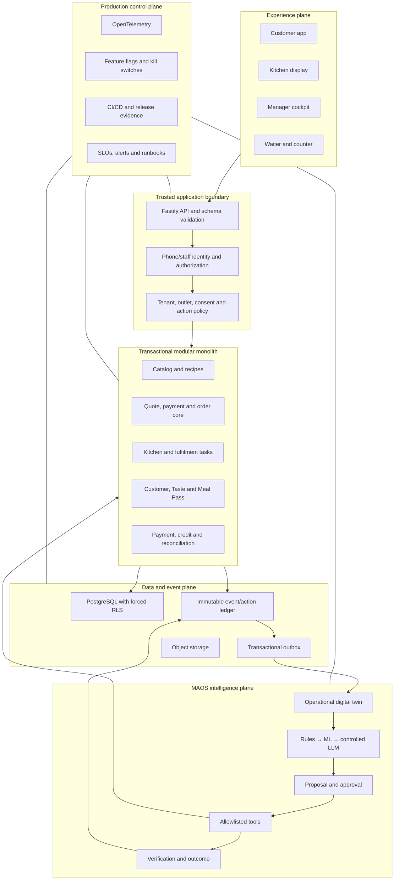

# MAOS Production Readiness Master Plan

## Engineering, security, AI, operations and release standard

**Product:** RMS / Mangamma AI-native cloud-kitchen operating system

**Repository:** `itsyourpriyansu-cloud/cc-rms`

**Primary market:** multi-brand cloud kitchens in India

**Current branch:** `b2`

**Status:** implementation source of truth; not a production-readiness claim

**Reviewed:** 29 July 2026

---

## 1. Purpose and authority

This document converts the MAOS production notes into the project-specific
standard for building, reviewing, testing and releasing this application.

It is the base plan for:

- product delivery;
- architecture decisions;
- security and privacy;
- AI-agent engineering;
- testing and quality;
- observability and reliability;
- CI/CD and release evidence;
- incident response;
- production-readiness review.

It complements:

- [`ai-native-cloud-kitchen-operating-system-architecture.md`](./ai-native-cloud-kitchen-operating-system-architecture.md),
  which defines the product and target architecture;
- [`cloud-kitchen-india-commercialization-report.md`](./cloud-kitchen-india-commercialization-report.md),
  which defines the commercial strategy.

When these documents conflict:

1. implemented contracts and migrations take precedence for current behaviour;
2. this document governs production engineering and release gates;
3. the architecture report governs the target product direction;
4. a reviewed Architecture Decision Record is required for a material change.

No feature, test result or polished interface may be described as
“production-ready” unless the applicable gates in this document have evidence.

---

## 2. Project-specific analysis of the source material

The supplied source is directionally correct. The following adaptations are
required for this repository.

| Source assumption | Current project reality | Required adaptation |
|---|---|---|
| Python/FastAPI backend | The backend is TypeScript, Node.js and Fastify 5 | Apply route/service/repository boundaries to Fastify; remove FastAPI-specific requirements |
| FastAPI integration tests | Vitest, Fastify injection, PGlite and PostgreSQL SQL are in use | Continue fast tests with PGlite, but add required CI integration tests against a supported real PostgreSQL version |
| Authentication is still planned | Phone OTP, opaque sessions and customer profile APIs were implemented in commit `050ce70` | Production SMS integration, database deployment, key rotation, role separation and end-to-end environment evidence remain |
| PostgreSQL and RLS are planned | Migrations, forced RLS, composite tenant relationships and an outbox were implemented in `67b2162` | Verify migrations and restore procedures on managed PostgreSQL; create least-privileged runtime and migration roles |
| MAOS contracts are planned | Events, proposals, risk controls and action receipts were implemented in `d8cc545` | Build policy-gated tool execution, approval verification and outcome evaluation |
| Customer state is browser-local | Authentication and core profile identity now use server APIs | Orders, payments, Meal Pass, fulfilment, favourites and several operating views still depend on browser/mock state |
| Microservice/SaaS-scale infrastructure may be needed | The product is at pre-pilot stage | Preserve the modular monolith and PostgreSQL; add infrastructure only after measured need |
| All listed controls may be treated equally | Some are release blockers; others are scale-stage improvements | Use the priority and rollout gates in this document |

### 2.1 Current technology baseline

- React 19 and React Router customer/role interfaces;
- Vite 8 build tooling;
- Fastify 5 API;
- TypeScript with strict compilation;
- Zod boundary contracts;
- PostgreSQL SQL migrations and row-level security;
- transactional MAOS event ledger and outbox;
- Vitest unit/API tests;
- PGlite PostgreSQL-compatible migration and integration tests;
- Axios customer API adapter;
- Leaflet-based mapping UI.

### 2.2 Current production verdict

**The repository is not yet production-ready.**

The first three foundations are implemented, but the following critical
capabilities are absent or incomplete:

- persisted menu, quote, checkout, payment and order orchestration;
- kitchen tasks and verified delivery milestones;
- staff authentication and server-side authorization;
- manager approval/tool execution;
- outbox publisher and consumer;
- OpenAPI and contract publication;
- OpenTelemetry instrumentation and operational dashboards;
- production SMS/payment/map/aggregator integrations;
- CI/CD, preview/staging and progressive release;
- real PostgreSQL CI and backup/restore evidence;
- end-to-end, accessibility, load and failure-injection suites;
- privacy export/deletion and retention workers;
- production deployment and runbooks.

The frontend also has existing lint warnings and an oversized JavaScript bundle.
The dependency audit currently reports the high-severity
[React Router RSC CSRF advisory](https://github.com/advisories/GHSA-qwww-vcr4-c8h2).
The project does not use the affected unstable RSC APIs, but a high advisory
still requires a documented mitigation or a tested upgrade to a patched version
before release.

---

## 3. Verified implementation baseline

| Foundation | Evidence | Implemented | Still required before production |
|---|---|---|---|
| Canonical MAOS contracts | Commit `d8cc545` | tenant/outlet/customer entities, order states, CloudEvents-style envelope, proposals, risk rules and receipts | publish schemas; compatibility tests; tool-schema registry |
| Tenant-safe PostgreSQL | Commit `67b2162` | migrations, forced RLS, tenant FKs, immutable audit triggers, order-transition trigger, outbox | managed PostgreSQL test; runtime/migrator roles; backup/restore; outbox worker |
| Customer phone authentication | Commit `050ce70` | OTP throttling, keyed digests, provider interface, HttpOnly cookie, session revocation, persisted core profile and consent | approved SMS/DLT provider; production secrets; key rotation; device/session controls; deployed E2E |
| Frontend integration | Commit `050ce70` | session restoration, API-backed login/profile, no browser-stored access token | failure/offline UX, accessibility tests, API deployment, remaining local/mock truth removal |
| Automated checks | Current repository | strict backend type-check, 36 backend tests, frontend lint/build | clean warning budget, component/E2E/load/security tests, real PostgreSQL CI |

“Implemented” means the code exists and current repository checks pass. It does
not mean a production environment, operator or customer has verified it.

---

## 4. Production architecture and control planes



### Non-negotiable architecture rules

- Client-provided tenant, role, price, tax, availability or payment status is
  never trusted.
- Every commercial side effect has an idempotency scope.
- Money is integer paise plus ISO currency.
- A business event is written in the same transaction as the business fact.
- An AI model cannot write to a business table or call an unrestricted tool.
- Order, payment, stock, proposal and action transitions are explicit.
- A provider response is not accepted as verified until reconciled with the
  authoritative provider or internal state.
- Local storage may cache non-authoritative UI preferences, never an order,
  payment, approval or operational truth.
- The modular monolith remains the default until measured scaling or isolation
  evidence justifies separation.

---

## 5. Master programme and dependency order

```mermaid
flowchart LR
    A["Completed: contracts"] --> B["Completed: PostgreSQL and RLS"]
    B --> C["Completed in code: customer auth"]
    C --> D["P0 production guardrails"]
    D --> E["Step 4A: order data model"]
    E --> F["Step 4B: quote and checkout"]
    F --> G["Step 4C: kitchen tasks and SSE"]
    G --> H["Step 4D: order-risk shadow agent"]
    H --> I["Step 5: manager approval and tools"]
    I --> J["Pilot readiness review"]
    J --> K["One-outlet controlled pilot"]
```



### 5.1 Priority definitions

| Priority | Meaning |
|---|---|
| P0 | blocks safe implementation or any production release |
| P1 | required for the first controlled outlet pilot |
| P2 | required before multi-outlet commercial scaling |
| P3 | optimisation after measured pilot evidence |

### 5.2 Immediate execution queue

| Order | Work package | Priority | Exit evidence |
|---|---|---:|---|
| 1 | Production guardrail pack | P0 | CI, secret/dependency scans, real PostgreSQL test, documented accepted risks |
| 2 | Order foundation migration — implemented in code | P0 | catalog/recipe/quote/payment-intent/kitchen-task/milestone schemas; RLS; immutable snapshots and optimistic-concurrency tests |
| 3 | Idempotent quote and checkout API | P0 | repeated request creates one payment intent/order; server-calculated totals |
| 4 | Payment verification boundary | P0 | signed webhook, server-to-server verification and reconciliation |
| 5 | Kitchen-task orchestration | P1 | recipe/modifier tasks appear once and obey legal transitions |
| 6 | SSE milestone stream | P1 | customer, kitchen and manager consume the same committed milestone |
| 7 | Order-risk projection | P1 | typed shadow proposal with evidence, confidence, expiry and no side effect |
| 8 | Manager approval and action tools | P1 | approve/reject, execute once, verify, receipt and rollback |
| 9 | Pilot hardening | P1 | E2E/accessibility/load/failure evidence, dashboards, alerts and runbooks |
| 10 | One-outlet pilot | P1 | progressive release, operator training, incident process and measured baseline |

Do not begin autonomous agent work before packages 1–8 are verifiably complete.

---

## 6. Plan A — transactional order and kitchen core

### Objective

Replace mock/browser state with one authoritative order workflow shared by the
customer, kitchen, counter and manager.

### Required domain additions

- brands and outlet-scoped catalog;
- menu items, modifiers, recipes, yields and allergen facts;
- availability and committed stock;
- immutable quote with expiry and calculation version;
- payment intent and provider references;
- order idempotency key and state version;
- recipe-derived kitchen tasks and station ownership;
- fulfilment and delivery milestones;
- order SLA/promise snapshots;
- status reason codes and actor identity.

### Checkout protocol

1. Authenticate customer and resolve tenant/outlet server-side.
2. Validate address/serviceability and delivery slot.
3. Re-read current item/modifier availability.
4. Calculate subtotal, discount, tax, packaging and delivery in paise.
5. Persist an expiring quote with calculation inputs/version.
6. Create or reuse a payment intent by idempotency key.
7. Verify provider result server-to-server.
8. Create the order, status event and MAOS event in one transaction.
9. Derive kitchen tasks from versioned recipe/modifier facts.
10. Return committed identifiers and status; never claim success from a
    browser redirect alone.

### Acceptance gate

- Duplicate checkout/webhook/retry creates one commercial result.
- Invalid or expired quote cannot become an order.
- Price and tax cannot be overridden by the client.
- Kitchen receives one task set with visible modifiers and allergen facts.
- Cross-tenant and cross-outlet access is rejected.
- Failure after payment verification enters reconciliation, not silent loss.
- Order and payment can be reconstructed by correlation ID.

---

## 7. Plan B — manager exception and controlled-action system

### Required lifecycle

`event → digital twin → proposal → policy → approval → tool → verification → receipt → outcome`

### Action-attempt record

Every action attempt records:

- proposal ID;
- actor or automation identity;
- tenant and outlet;
- tool name and validated-arguments hash;
- before-state hash or authoritative reference;
- external provider reference;
- status;
- verification evidence;
- after-state hash or authoritative reference;
- rollback/recovery window;
- duration;
- AI and provider cost;
- error class and retryability when failed;
- correlation, causation, policy, model and prompt versions.

### Tool requirements

An allowlisted tool must define:

- purpose and owner;
- input/output schema;
- permitted actor roles;
- risk class;
- tenant/outlet scope;
- monetary, quantity and frequency bounds;
- idempotency scope;
- preconditions;
- timeout/retry policy;
- verification query;
- rollback or compensating action;
- audit and metric fields;
- kill switch.

### Initial tools

| Tool | Initial risk | Initial execution |
|---|---:|---|
| `order.adjust_promise` | A2 | manager approval |
| `menu.pause_item` | A2 | manager approval |
| `menu.restore_item` | A2 | manager approval or verified scheduled recovery |
| `customer.issue_credit` | A3 | explicit financial approval and amount cap |
| `payment.refund` | A3 | separate approval, provider verification and reconciliation |

No A2/A3 tool begins in automatic mode.

---

## 8. Plan C — AI and ML engineering

### 8.1 Technology selection

| Need | Required approach |
|---|---|
| permissions, limits, allergens, hours, taxes | deterministic rules |
| demand, ETA, churn, anomaly, ranking | measured statistical/ML model |
| invoice extraction, review summary, command interpretation | language/vision model with strict schema |
| SOP, recipe or policy answer | retrieval from approved documents with citations |
| business side effect | policy-gated allowlisted tool |
| money, ledger and stock calculation | transactional code |

### 8.2 Model gateway

All future model calls pass through one internal gateway providing:

- provider abstraction and model allowlist;
- deadline, cancellation and bounded retry;
- prompt/template/model version;
- structured-output validation;
- PII minimisation/redaction;
- safe logging without raw sensitive prompts;
- token/provider-cost accounting;
- per-tenant, agent and workflow budgets;
- fallback to rules/templates/manual review;
- evaluation and outcome hooks.

Feature modules must not import model-provider SDKs directly.

### 8.3 Prompt-injection and retrieval rules

- Customer, supplier, review, document, image and web content is untrusted.
- Retrieved data cannot redefine system policy, identity or tool permissions.
- Retrieval is tenant-scoped and restricted to approved corpora.
- Each passage retains source, version and provenance.
- Rendered output is sanitised.
- Citations are checked against retrieved content.
- Tool arguments are independently validated and authorised.

### 8.4 Rollout stages

| Stage | Behaviour | Promotion evidence |
|---|---|---|
| 0 Offline replay | historical events only | schema correctness, baseline result, no forbidden action |
| 1 Shadow | live and invisible | stable data quality, latency and cost |
| 2 Recommend | manager sees proposal | useful explanation, acceptance and low harmful rate |
| 3 Assisted | approval invokes and verifies | idempotency, provider reliability and rollback |
| 4 Limited automation | bounded A1 actions | sustained precision and low incident/override rate |
| 5 Adaptive limits | outlet-specific tuning | governance approval and continuous monitoring |

Initial minimum gates:

- at least 95% correct classification for low-risk automation;
- at least 99% successful idempotent tool execution;
- zero unresolved tenant or food-safety incidents;
- measurable improvement over baseline;
- tested override and rollback;
- cost within tenant budget.

### 8.5 Evaluation dataset

Each agent requires versioned:

- normal, edge and ambiguous cases;
- malicious/prompt-injection cases;
- tenant-isolation and authorization cases;
- missing/stale/conflicting data;
- provider timeout and partial failure;
- expected structured output;
- business-harm severity;
- protected holdout data.

Track cost per successful business outcome, not token cost alone.

---

## 9. Plan D — security, privacy and compliance

### 9.1 Security baseline

Use [OWASP ASVS 5.0.0](https://owasp.org/www-project-application-security-verification-standard/)
Level 2 as the internet-facing baseline. Apply stronger controls to payment,
staff administration, exports and A3/A4 automation. ASVS references should
include the version, for example `v5.0.0-x.y.z`.

Create a separate verification matrix mapping each applicable requirement to:

- applicability and rationale;
- code/config evidence;
- automated/manual test;
- owner;
- status;
- accepted residual risk.

### 9.2 Immediate P0 security work

- Resolve or formally mitigate the current React Router high advisory.
- Add server-side staff identity, role and outlet authorization.
- Create migration and runtime database roles without superuser/BYPASSRLS.
- Add secret and dependency scanning in CI.
- Add strict production CORS/origin policy and verify cookie-CSRF controls.
- Add response schemas to reduce accidental data disclosure; Fastify’s
  [validation and serialization guidance](https://fastify.dev/docs/latest/Reference/Validation-and-Serialization/)
  recommends schema-based request validation and response serialization.
- Verify that authentication logs never include OTPs, cookies or phone values.
- Add key/pepper rotation without invalidating audit evidence.
- Threat-model payment, webhooks, uploads, AI tools, admin roles and data export.

### 9.3 Required API/web controls

- strict input and output schemas;
- parameterised SQL;
- server-side authorization on every protected operation;
- CSRF protection for cookie-authenticated mutations;
- restrictive CORS/origin allowlist;
- CSP, secure headers, HTTPS and HSTS;
- safe redirect allowlist;
- brute-force and enumeration resistance;
- bounded request body/file size;
- file type/content validation and malware scanning where applicable;
- SSRF protection for server-side retrieval;
- redacted errors and logs;
- sensitive read/write audit.

### 9.4 Privacy

- Purpose-specific notices and consent version/timestamp;
- phone authentication does not imply marketing consent;
- preference correction and deletion;
- tenant/customer export;
- documented retention and scheduled deletion;
- data classification and sensitive-access logging;
- processor/subprocessor register;
- minimised model-provider transfer;
- production data excluded from provider training unless separately approved.

### 9.5 Payment boundary

- Use a regulated payment provider.
- Store provider tokens and references only.
- Verify status server-to-server.
- Sign, timestamp, idempotently process and reconcile webhooks.
- Treat return URLs as UX signals, not payment truth.
- Apply A3 controls to refund/credit.
- Never request or store a UPI PIN.

### 9.6 Security release blockers

- unmitigated critical/high vulnerability;
- tenant-isolation or authorization failure;
- secret/PII exposure;
- unsigned payment/partner webhook;
- direct AI database access;
- unbounded financial tool;
- destructive migration without test/rollback;
- food-safety or allergen-control bypass.

---

## 10. Plan E — testing and quality

### 10.1 Required layers

| Layer | Project use |
|---|---|
| Unit | domain rules, money, states, policies and UI logic |
| Component | accessible rendering and interaction |
| API integration | Fastify + real PostgreSQL + auth + transactions |
| Contract | OpenAPI, event, webhook and tool compatibility |
| End-to-end | critical role workflows in production-like staging |
| Replay | duplicate checkout, webhook, outbox and tool execution |
| Concurrency | order, stock, payment, OTP and approval races |
| Accessibility | automation plus keyboard/screen-reader review |
| Performance | API, bundle, SSE fan-out and SQL |
| Security | authorization, tenant isolation, abuse and dependencies |
| Failure injection | provider timeout, worker crash, reconnect and partial action |

PGlite remains valuable for fast migration tests, but it is not the sole
production-database gate.

### 10.2 Critical end-to-end flows

Automate:

- customer OTP login, restore, revoke and expired session;
- valid menu configuration and quote;
- idempotent checkout and payment result;
- one persisted order reaches kitchen once;
- modifier/allergen facts reach kitchen;
- role/outlet permissions;
- kitchen progress reaches customer/manager;
- order-risk proposal evidence and expiry;
- approve/reject and exactly-once tool execution;
- expired/unapproved proposal cannot act;
- item pause propagation and safe restore;
- refund approval separate from execution;
- cross-tenant rejection;
- offline/reconnect without duplicate order;
- closing reconciliation mismatch.

### 10.3 Deterministic testing

- Inject clock and ID generation.
- Freeze expiry/schedule time.
- Use seeded factories and isolated fixtures.
- Avoid sleep-based assertions.
- Stub providers at adapter boundaries.
- Randomise test order where practical.
- Convert each production incident to a regression test.

### 10.4 Initial quality gates

- Critical domain modules: at least 90% meaningful branch coverage.
- Overall: 80% directional coverage, without trivial tests.
- Zero failing type, test or build checks.
- New/changed files introduce no lint warnings.
- Existing lint-warning debt has an owned burn-down plan.
- Critical customer flows meet WCAG 2.2 AA.
- Bundle budgets are enforced; current large-bundle warning must be resolved
  before production.

---

## 11. Plan F — observability and SRE

Use [OpenTelemetry](https://opentelemetry.io/docs/what-is-opentelemetry/) for
vendor-neutral traces, metrics and logs. OpenTelemetry is instrumentation, not
the storage/dashboard backend; the deployment plan must select a compatible
collector/backend.

### 11.1 Correlation chain

One correlation/trace context connects:

`request → quote → payment → order transaction → outbox → kitchen task → milestone → digital twin → proposal → approval → tool → verification → receipt`

### 11.2 Structured log fields

- timestamp, level, environment, release version;
- service/module and operation;
- correlation, trace and span ID;
- tenant/outlet where safe;
- opaque actor identity/type;
- event/tool;
- outcome, duration and error code.

Never log phone, address, OTP, cookie, auth token, payment credential or full
model prompt.

### 11.3 Initial SLOs

| Capability | Initial internal objective |
|---|---:|
| Order creation availability | 99.9% monthly |
| Core API server error rate | below 1%, excluding valid 4xx |
| Normal read API p95 | below 500 ms under tested load |
| Checkout server processing p95 | below 1.5 s excluding payment interaction |
| Committed milestone to SSE p95 | below 2 s |
| Signed webhook accepted/queued p95 | below 2 s |
| Normal outbox processing lag p95 | below 10 s |
| Idempotent tool execution | at least 99% after rollout gate |
| Cross-tenant incidents | 0 |

Objectives remain internal until measured under documented traffic.

### 11.4 Required alerts and runbooks

Urgent alerts:

- order-creation outage/error spike;
- payment reconciliation divergence;
- tenant/security event;
- stuck outbox;
- repeated side effect;
- migration/backup failure;
- food-safety control failure;
- A3/A4 policy bypass.

Runbooks:

- order API outage;
- payment provider degradation;
- duplicate webhook/action;
- stuck outbox/worker;
- database restore;
- secret rotation;
- bad frontend/service-worker release;
- model outage/cost spike;
- tenant data incident;
- rollback of promise/item-pause action.

---

## 12. CI/CD and release engineering

### 12.1 Required CI pipeline

1. Reproducible install from lockfiles.
2. Formatting/lint and warning budget.
3. Backend and frontend type checks.
4. Unit/component tests and coverage.
5. Empty-state and upgrade migrations.
6. Real PostgreSQL integration.
7. OpenAPI/event/tool contract tests.
8. Frontend production build and bundle budget.
9. Dependency, secret and static-code scans.
10. SBOM generation.
11. Accessibility smoke test.
12. Critical E2E on preview/staging.
13. Artifact metadata and provenance.

GitHub Actions must receive least privilege. Pin third-party actions to full
commit SHAs; GitHub provides a repository policy to
[require full-length SHA pinning](https://docs.github.com/en/repositories/managing-your-repositorys-settings-and-features/enabling-features-for-your-repository/managing-github-actions-settings-for-a-repository).

### 12.2 Environments

- local development;
- shared integration/preview;
- production-like staging;
- production.

Do not copy production personal data to lower environments without approved
anonymisation.

### 12.3 Deployment

- Build once and promote the immutable artifact.
- Record git SHA, build ID, migration and configuration version.
- Run compatibility/pre-deploy checks.
- Back up and apply safe migrations.
- Deploy behind health/readiness checks.
- Run smoke tests.
- Monitor technical and business signals.
- Roll out high-risk work to one tenant/outlet first.
- Roll back application independently where schema compatibility permits.

### 12.4 Feature flags

Every flag requires owner, purpose, target, default, creation/expiry date,
telemetry and rollback behaviour. A flag is not permanent configuration.

---

## 13. Coding and contract standards

### 13.1 TypeScript/Fastify

- Strict TypeScript remains mandatory.
- Routes validate/serialise and call application services.
- Services enforce use cases and transaction boundaries.
- Repositories own persistence queries.
- External providers implement typed adapters.
- No broad catch without mapped context.
- No unbounded retry.
- No provider SDK in domain code.
- No domain rule in React components or route handlers.
- Startup validates all production configuration.

### 13.2 SQL

- Parameterised queries only.
- Name important constraints and indexes in future migrations.
- Tenant/outlet scope for operational update/delete.
- Preview/count before data repair scripts.
- Backward-compatible expand/migrate/contract pattern where uptime requires it.
- Tested rollback or forward-fix for every production migration.

### 13.3 Frontend

- No API call in low-level presentation components.
- Semantic HTML before ARIA.
- Keyboard, touch and screen-reader states.
- Loading, empty, error, offline and reconnect behaviour.
- One token source for colour, spacing, type, radius, elevation and motion.
- No new raw colours once design tokens are established.
- Stable keys for reorderable records.
- Offline UI never confirms an uncommitted commercial action.

### 13.4 Units and formats

- money: integer paise plus ISO currency;
- timestamps: RFC 3339 UTC;
- timezone: IANA name;
- duration: explicit unit;
- quantity: value plus unit;
- percentage: documented scale;
- ID: opaque string.

### 13.5 Contract governance

Each API/event/tool contract has an owner, version, examples, validation tests,
compatibility policy and deprecation plan.

Prefer additive change. Version or coordinate any change to field meaning,
requiredness, state semantics, idempotency or authorization.

---

## 14. UX governance by role

| Role | Production experience goal |
|---|---|
| Customer | effortless discovery, honest availability/ETA, transparent payment and cancellation, verified timeline |
| Kitchen | immediate next task, station ownership, elapsed time, prominent modifier/allergen facts, safe recovery |
| Waiter | table, order and request clarity without manager finance/configuration |
| Counter | rapid lookup, payment/receipt accuracy, safe void/refund escalation |
| Manager | exception inbox first; evidence, confidence, expiry, approval, verification and undo |

Critical screens target [WCAG 2.2 AA](https://www.w3.org/TR/WCAG22/).
Test at 390 px mobile width and actual target kitchen/counter display sizes.

---

## 15. Definition of Ready

A task is ready only when it states:

- user/role and business outcome;
- acceptance criteria and explicit exclusions;
- domain/module owner;
- data/API/event impact;
- tenant/outlet/permission scope;
- failure, offline and reconnect behaviour;
- observability requirement;
- design/interaction reference;
- test scenarios;
- rollout and rollback where relevant.

A2–A4 automation also requires risk, approval, expiry, evidence, verification,
financial/quantity bound and recovery plan.

---

## 16. Definition of Done

### Functionality

- Acceptance and failure paths pass.
- Role/tenant boundaries are correct.
- Loading/error/offline/reconnect states exist.
- Idempotency and concurrency are addressed.

### Code and contracts

- Architecture conventions are preserved.
- No duplicate subsystem or speculative platform is introduced.
- Lint, type, tests and builds pass.
- Configuration is validated/documented.
- Migration and contracts are versioned/tested.

### Security/privacy

- Authorization and cross-tenant tests pass.
- Threat model is updated when applicable.
- No secret/PII leakage.
- Dependency/security checks pass or risk is formally accepted.
- Consent, retention and audit needs are met.

### Operations

- Logs, metrics and traces exist.
- Alert/runbook is updated where operationally significant.
- Feature flag and rollout exist for risky work.
- Rollback/forward-fix is documented.

### AI-specific

- Structured schema validates.
- Evaluation threshold passes.
- No direct database write.
- Policy/approval gate is tested.
- Tool is idempotent and verified.
- Cost, fallback, override and drift signals exist.

---

## 17. Code-review rejection gates

Reject a change that:

- mixes unrelated refactoring and business behaviour;
- adds an unjustified dependency;
- trusts client tenant/role/price/payment data;
- uses floating-point money;
- lacks idempotency for a side effect;
- writes across modules arbitrarily;
- emits an event outside the fact transaction;
- lets model output bypass policy;
- sends outreach without consent/frequency control;
- lacks failure UX;
- weakens test/type/security checks;
- claims “production-ready” without release evidence.

Review depth follows risk, not line count.

---

## 18. Architecture Decision Records

Create `docs/adr/ADR-NNN-title.md` for decisions expensive to reverse.

```markdown
# ADR-NNN: Decision title

## Status
Proposed | Accepted | Superseded | Rejected

## Context
Problem, evidence and constraints.

## Decision
The selected approach.

## Alternatives considered
Options and rejection reasons.

## Consequences
Benefits, costs, risks and migration.

## Security, privacy and operations
Controls, telemetry and runbooks.

## Exit strategy
How the decision can be reversed.
```

ADR-required examples:

- changing React/Fastify architecture;
- new database/queue/state platform;
- service extraction;
- authentication/session model change;
- money/ledger representation change;
- autonomous A2/A3 behaviour;
- provider or data-residency strategy.

---

## 19. Incident response and kill switches

| Severity | Example |
|---|---|
| SEV-0 | food-safety breach, active cross-tenant exposure, payment compromise |
| SEV-1 | widespread order/payment outage, repeated financial action, major data loss |
| SEV-2 | degraded major workflow, significant delay/reconciliation backlog |
| SEV-3 | limited defect with workaround |

Incident process:

1. Assign incident commander.
2. Protect customers and stop harmful automation.
3. Preserve evidence and correlation IDs.
4. Communicate impact/workaround.
5. Mitigate or roll back.
6. Verify recovery with business metrics.
7. Reconcile orders/payments/actions.
8. Complete blameless review.
9. Add regression test/control/runbook.

Audited kill switches must disable an agent, tool, provider, tenant/outlet
rollout or all automatic actions, and fall back to deterministic/manual flow.

---

## 20. Production readiness checklist

### Product and data

- [ ] Critical flows have no mock/browser truth.
- [ ] Canonical order state is used by all roles.
- [ ] Empty and upgrade migrations pass on real PostgreSQL.
- [ ] Runtime and migration roles are least-privileged.
- [ ] RLS and server authorization pass.
- [ ] Backup and restore are demonstrated.
- [ ] Retention, export and deletion are implemented.

### API, event and payment

- [ ] `/api/v1` OpenAPI is published and tested.
- [ ] Checkout, webhook and tools are idempotent.
- [ ] Outbox publisher/consumer is operational.
- [ ] Correlation/causation reaches all critical facts.
- [ ] Payment webhook is signed, verified and reconciled.
- [ ] Contract compatibility passes.

### Frontend

- [ ] WCAG 2.2 AA critical-flow evidence exists.
- [ ] Target mobile/operational displays are tested.
- [ ] Offline/reconnect cannot confirm false success.
- [ ] Bundle and Core Web Vitals budgets pass.
- [ ] Existing lint warnings are resolved or explicitly budgeted.

### Security/privacy

- [ ] ASVS 5.0.0 matrix is reviewed.
- [ ] Threat models are current.
- [ ] High/critical dependency findings are mitigated.
- [ ] Secrets and CI supply chain are scanned.
- [ ] PII is redacted from logs/model calls.
- [ ] Food-safety and A4 controls cannot be bypassed.

### Reliability and release

- [ ] OpenTelemetry signals reach the selected backend.
- [ ] SLO dashboards and actionable alerts exist.
- [ ] Load, duplicate and provider-failure tests pass.
- [ ] Runbooks and rollback are exercised.
- [ ] Staging matches production contracts/configuration.
- [ ] One-outlet progressive pilot is monitored.

### AI/MAOS

- [ ] Agent owner, objective, schema and forbidden actions exist.
- [ ] Replay/shadow evidence passes.
- [ ] Proposal includes evidence, risk, expiry and recovery.
- [ ] Tool is allowlisted, bounded, idempotent and verified.
- [ ] Receipt/outcome is immutable.
- [ ] Tenant cost/call limits and kill switches are active.

---

## 21. Risk register

| Risk | Current state | Priority | Required treatment |
|---|---|---:|---|
| Browser/mock order truth | present | P0 | Step 4 persisted order vertical slice |
| No staff server authorization | absent | P0 | staff identity, role/outlet policy and tests |
| React Router high advisory | audit finding; affected RSC API not used | P0 | upgrade/mitigation test and documented acceptance until closed |
| No real PostgreSQL CI | absent | P0 | service container integration and migration upgrade tests |
| No outbox worker | absent | P0 | leasing, retry/dead-letter, lag metrics and replay |
| No payment verification | absent | P0 | provider adapter, signed webhook and reconciliation |
| No OpenTelemetry | absent | P1 | HTTP/DB/outbox/order traces and metrics |
| Frontend bundle above warning threshold | present | P1 | route/code splitting and enforced budget |
| Existing lint debt | present | P1 | baseline file and progressive zero-new-warning gate |
| No E2E/accessibility suite | absent | P1 | critical customer/kitchen/manager flows |
| No backups/restore evidence | absent | P1 | managed schedule and restore drill |
| No AI gateway/tool executor | intentionally absent | P1 before agents | build only after transactional vertical slice |
| Production SMS provider not selected | dev adapter only | P1 | DLT-capable provider, credentials, delivery/rotation runbook |
| No CI/CD environments | absent | P0 | preview, staging, production promotion pipeline |

---

## 22. Release evidence pack

Every production candidate must retain:

- git SHA and immutable artifact digest;
- dependency lockfile and SBOM;
- migration versions/checksums;
- environment/configuration version without secrets;
- test, coverage, accessibility and security results;
- OpenAPI/event/tool schema versions;
- load/failure test report;
- backup/restore evidence;
- threat-model/ASVS changes;
- feature flags and rollout targets;
- dashboards, alerts and runbook links;
- approval and accepted-risk records;
- smoke results and rollback decision.

Evidence should be machine-generated where possible and attached to the
release, not reconstructed after an incident.

---

## 23. Official standards baseline

Engineering decisions align with current stable official documentation:

- [OWASP ASVS 5.0.0](https://owasp.org/www-project-application-security-verification-standard/)
- [WCAG 2.2](https://www.w3.org/TR/WCAG22/)
- [CloudEvents](https://cloudevents.io/)
- [OpenTelemetry](https://opentelemetry.io/docs/)
- [PostgreSQL row security](https://www.postgresql.org/docs/current/ddl-rowsecurity.html)
- [Fastify validation and serialization](https://fastify.dev/docs/latest/Reference/Validation-and-Serialization/)
- [Vite production build](https://vite.dev/guide/build.html)
- [Core Web Vitals](https://web.dev/articles/vitals)
- [GitHub Actions secure use](https://docs.github.com/en/actions/reference/security/secure-use)

Review this baseline at least quarterly and when a major framework/security
release occurs. Material changes require an ADR and reviewed pull request.

---

## 24. Next approved implementation task

Step 4A is implemented in code and verified on the PostgreSQL-compatible PGlite
engine. Its production acceptance remains open until the migration also passes
the real-PostgreSQL CI, forward-fix and rollback rehearsal defined below.

The next implementation task is:

> **Production Guardrail Pack + Step 4B Quote, Payment and Checkout API**

It should be split into two reviewable commits/PRs.

### Commit/PR 1 — production guardrails

- create CI with pinned actions and least permissions;
- run current checks and real PostgreSQL integration;
- add dependency/secret scanning and SBOM;
- record/resolve the React Router advisory;
- create an OpenAPI generation/validation decision;
- establish zero-new-warning and bundle budgets.

### Completed implementation unit — Step 4A order foundation

- migration for catalog, recipes, availability, quotes, payment intents,
  kitchen tasks and milestones;
- tenant/outlet RLS and composite foreign keys;
- money and quote invariants;
- order/payment/idempotency constraints;
- PostgreSQL-compatible database, isolation and optimistic-concurrency tests;
- event contracts for quote/order/task/milestone;
- no frontend checkout switch until the persisted API passes.

### Remaining production acceptance and Step 4B

- [ ] migrations pass from empty and current schema on real PostgreSQL CI;
- [x] malicious cross-tenant reads and relationships fail in integration tests;
- [x] duplicate quote/idempotency constraints prevent duplicate commercial facts;
- [x] an expired or already-consumed quote cannot be ordered;
- [x] money is calculated and constrained in paise;
- [x] accepted recipe/modifier snapshots cannot be changed on placed lines;
- [ ] quote and checkout endpoints calculate only from server-side catalog facts;
- [ ] signed provider verification and reconciliation are implemented;
- [ ] every committed quote/payment/order fact writes its outbox event in the
  same transaction;
- [ ] retry and true concurrent checkout tests pass on real PostgreSQL;
- [ ] rollback/forward-fix and release evidence exist.

---

## 25. Final engineering position

MAOS becomes production-ready only when the customer application, transactional
kitchen core, digital twin and controlled automation plane work as one
verifiable system.

A polished interface without transactional truth is not production-ready.

A recommendation without evidence and policy is not automation.

A happy-path test without replay, tenant and failure evidence is not reliable.

A deployment without telemetry, rollback and an owner is not operated
software.

The product must remain:

- safe enough to trust;
- simple enough to operate;
- observable enough to diagnose;
- modular enough to evolve;
- measurable enough to improve;
- disciplined enough for consistent human and AI development.
